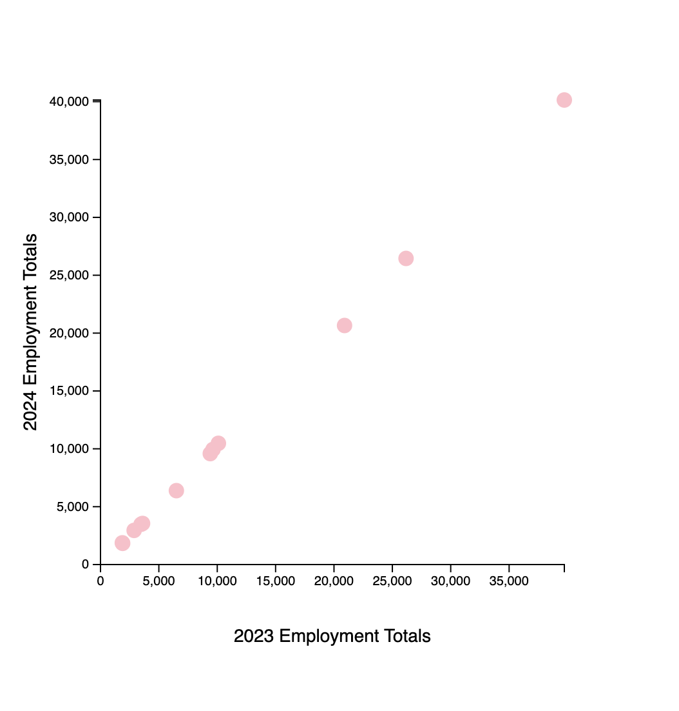

## D3 Homework 1 Documentation

The data originates from the Current Population Survey, which is a comprehensive monthly household survey conducted by the U.S. Census Bureau for the U.S. Bureau of Labor Statistics (BLS). The specific metrics utilized for this analysis represent the annual averages for the year 2024 and year 2023 for comparison. They are calculated using updated population information introduced annually. From the US BLS page, the dataset was specifically extracted from Table 9 of the "Characteristics of the employed" category. The scatterplot made with JavaScript (JS) visualizes the relationship between employment totals from 2023 and 2024 across various occupations that are represented by the circles. By such plotting, the chart allows for a quick comparison of workforce growth or decline between the two years. All of this connects to concepts of Public Data because the data describes US employment dynamics, which subsequently helps in understanding the job market

Screenshot of Scatterplot:

Citations & Source Links:
+ US BUREAU OF LABOR STATISTICS Main Page - https://www.bls.gov/
+ 2024 Household Data Annual Averages Page - https://www.bls.gov/cps/cps_aa2024.htm
+ Table 9, Employed Persons by Occupation, Sex, and Age (PDF) - https://www.bls.gov/cps/data/aa2024/cpsaat09.pdf
