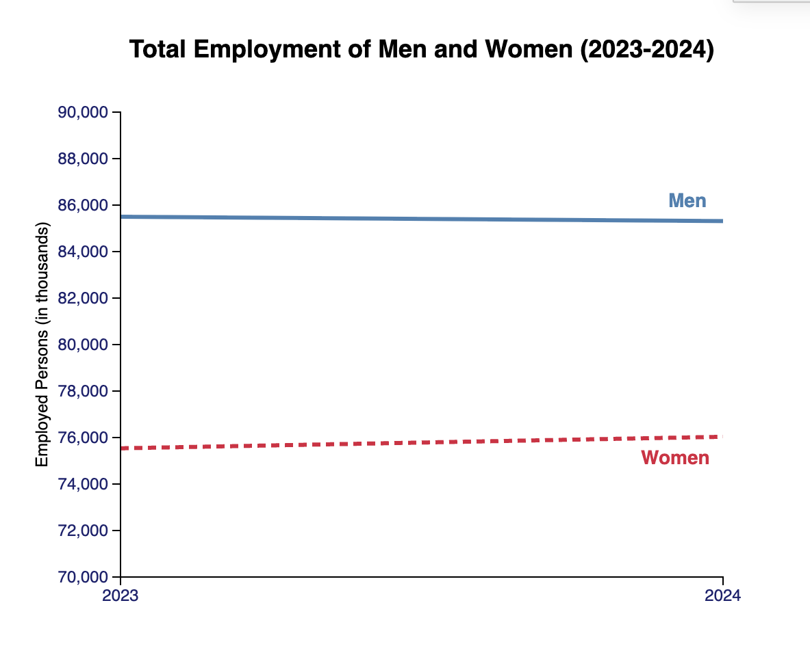

# D3 Homework 2 Documentation
The data originates from the Current Population Survey, which is a comprehensive monthly household survey conducted by the U.S. Census Bureau for the U.S. Bureau of Labor Statistics (BLS). The specific metrics utilized for this analysis represent the annual averages for the year 2024 and year 2023 for comparison. They are calculated using updated population information introduced annually. From the US BLS page, the dataset was specifically extracted from Table 9 of the "Characteristics of the employed" category. The visualization is a multi-line chart that comparatively looks at total employment figures between men and women between 2023 and 2024. As can be seen on the chart, men maintained a higher overall employment count, but had a nearly stagnant change of count from 2023 to 2024. Women overall employment count on the other hand, trended upward from 2023 to 2024. This subject connects to the broader topic of public data because it is accessible information that provides insights of employment trends. When viewing employment trends, you ultimately can have one facet of understanding towards the job market, and subsequently the economy.

Citations & Source Links:
+ US BUREAU OF LABOR STATISTICS Main Page - https://www.bls.gov/
+ 2024 Household Data Annual Averages Page - https://www.bls.gov/cps/cps_aa2024.htm
+ Table 9, Employed Persons by Occupation, Sex, and Age (PDF) - https://www.bls.gov/cps/data/aa2024/cpsaat09.pdf