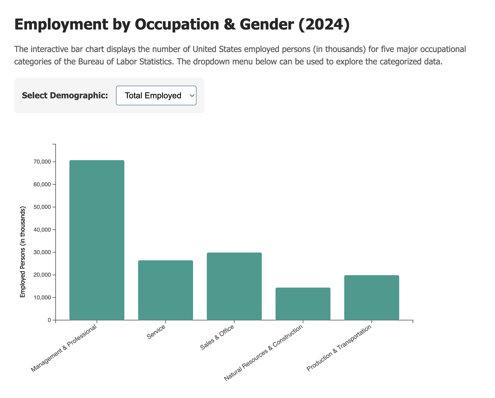

# D3 Homework 3 Documentation
The data originates from the Current Population Survey, which is a comprehensive monthly household survey conducted by the U.S. Census Bureau for the U.S. Bureau of Labor Statistics (BLS). The specific metrics utilized for this analysis represent the annual averages for the year 2024. They are calculated using updated population information introduced annually. From the US BLS page, the dataset was specifically extracted from Table 9 of the "Characteristics of the employed" category. The interactive bar chart visualizes the 2024 annual average of employed persons, aged 16 and over, across five major occupational categories in the US. The employment figures were measured in thousands for the fields of Management & Professional, Service, Sales & Office, Natural Resources & Construction, and Production & Transportation. The dropdown menu allows you to to explore total employment, or isolate the data by gender category. When a new demographic is selected, the chart updates the bar heights, axis values, and the color schemes. A tooltip appears accordingly when hovering over individual bars to reveal more precise numerical data in correspondence to the vertical axis.

Citations & Source Links:
+ US BUREAU OF LABOR STATISTICS Main Page - https://www.bls.gov/
+ 2024 Household Data Annual Averages Page - https://www.bls.gov/cps/cps_aa2024.htm
+ Table 9, Employed Persons by Occupation, Sex, and Age (PDF) - https://www.bls.gov/cps/data/aa2024/cpsaat09.pdf