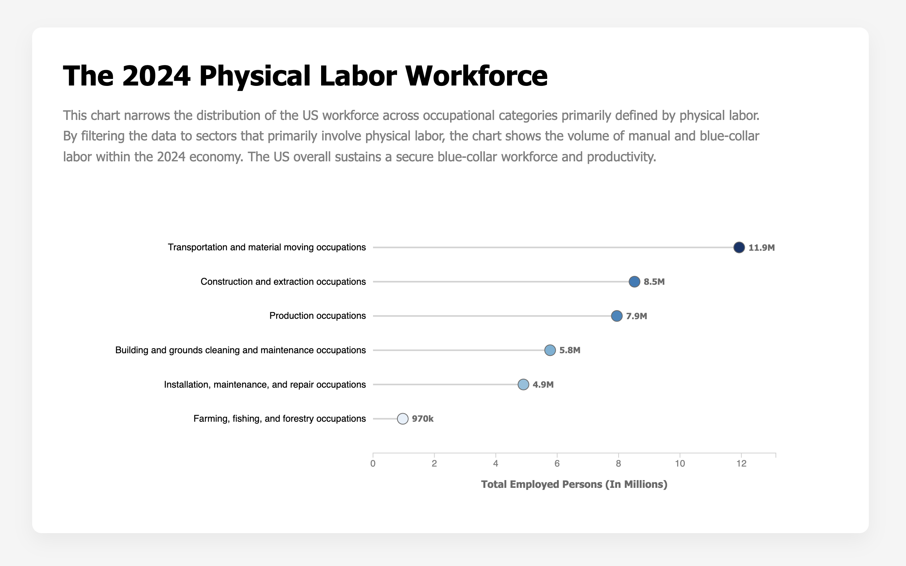

# D3 Homework 4 Documentation
The data originates from the Current Population Survey, which is a comprehensive monthly household survey conducted by the U.S. Census Bureau for the U.S. Bureau of Labor Statistics (BLS). The specific metrics utilized for this analysis represent the annual averages for the year 2024. They are calculated using updated population information introduced annually. From the US BLS page, the dataset was specifically extracted from Table 9 of the "Characteristics of the employed" category. The visualization is a horizontal lollipop chart that visualizes the 2024 employment volume of physical labor occupations in the US. Six blue-collar sectors were selected to be highlighted, with their total workforce size shown in millions. The categories were sorted from largest to smallest in order to illustrate where manual labor jobs are most heavily concentrated. In order to support such order, darker shades blue were used for larger values, while lighter shades were used for smaller values. The transportation and material moving occupation field was the dominate sector and the farming, fishing, and forestry occupation field was the least dominate sector. This data story is important and connects to public data investigations because it visually quantifies the scale of the US blue-collar workforce which is known to be a vital backbone to the US economy for decades.

Citations & Source Links:
+ US BUREAU OF LABOR STATISTICS Main Page - https://www.bls.gov/
+ 2024 Household Data Annual Averages Page - https://www.bls.gov/cps/cps_aa2024.htm
+ Table 9, Employed Persons by Occupation, Sex, and Age (PDF) - https://www.bls.gov/cps/data/aa2024/cpsaat09.pdf