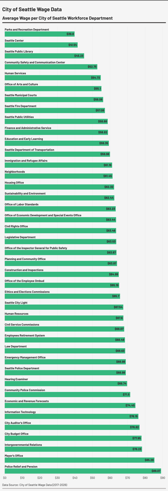

# Flourish 1 Assignment
The visualization is a horizontal bar chart showing the average hourly wage in each department of the City of Seattle's workforce. The parks and recreation department had the lowest average hourly wage, while Police Relief and Pension had the highest hourly wage. The bars are ranked in ascending order based on the corresponding hourly rate. A green color was utilized and each department name is labeled above each bar. Each value was rounded to the nearest tenth decimal value in USD. To get the numbers, all the jobs in the data were aggregated into the 41 assigned departments. Doing this enabled for averaged values to be calculated. Each department consisted of dozens of different positions, so a lot of the cleaning involved aggregation. All the information came from the City of Seattle Wage Data which was found on the Seattle Open Data portal. The data is under the city administration category and was provided by the Seattle Department of Human Resources. As of when the visualization was made, the data contained 13,864 fields. Ultimately, the exploration of this subject provided an insight into the job wage environment of the Seattle area.

Important Links & Citations:
+ Seattle Open Data Website: https://data.seattle.gov/
+ City of Seattle Wage Data (About Section): https://data.seattle.gov/City-Administration/City-of-Seattle-Wage-Data/2khk-5ukd/about_data
+ City of Seattle Wage Data (Data Section):https://data.seattle.gov/City-Administration/City-of-Seattle-Wage-Data/2khk-5ukd/data_preview
+ Published Flourish Visualization: https://public.flourish.studio/visualisation/28548278/

