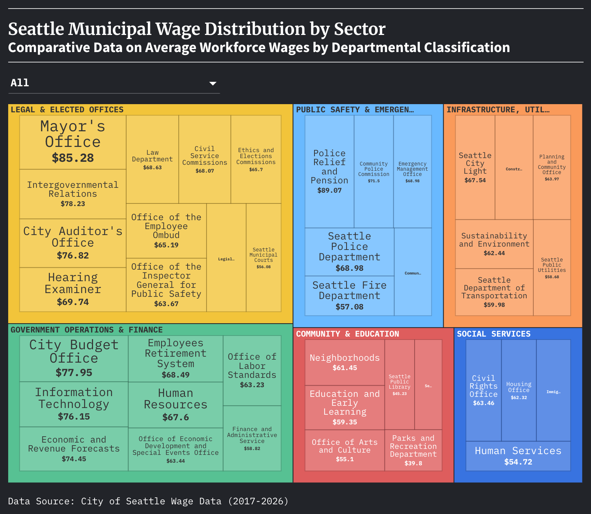

# Flourish 2 Assignment 
The visualization is a treemap showing the sector wage distribution for Seattle municipal based positions. All the information came from the City of Seattle Wage Data which was found on the Seattle Open Data portal. The data is under the city administration category and was provided by the Seattle Department of Human Resources. The data file was previously used in the "Flourish 1 Assignment" and was cleaned accordingly for analysis. In addition to cleaning, I added a new field into the data called "Category". There are six variables under this new field (Legal & Elected Offices, Government/Operations & Finance, Public Safety & Emergency Services, Infrastructure/Utilities & Environment, Community & Education,and Social Services). The purpose of the "Category" field, is that it's suppose to categorize every Seattle municipal department into six aggregated groups for subsequent comparison. In the treemap, there are six boxes with their own unique color and each box contains the municipal departments with their average hourly wage. When hovering over the boxes as a whole, viewers can see the totaled average of each whole category. This analytical visualization took the patterns/anomalies approach. By designating departments within functional categories, the treemap chart displays a pattern that Legal & Elected Offices and Government Operations and Finance occupy a dominant footprint. Such footprint shows a more firm administrative core compared to the smaller footprint of Community & Education and Social Services. The structure can raise questions or ideas about municipal dynamics in Seattle.

Important Links & Citations:
+ Seattle Open Data Website: https://data.seattle.gov/
+ City of Seattle Wage Data (About Section): https://data.seattle.gov/City-Administration/City-of-Seattle-Wage-Data/2khk-5ukd/about_data
+ City of Seattle Wage Data (Data Section): https://data.seattle.gov/City-Administration/City-of-Seattle-Wage-Data/2khk-5ukd/data_preview
+ Published Flourish Visualization: https://public.flourish.studio/visualisation/28657712/

